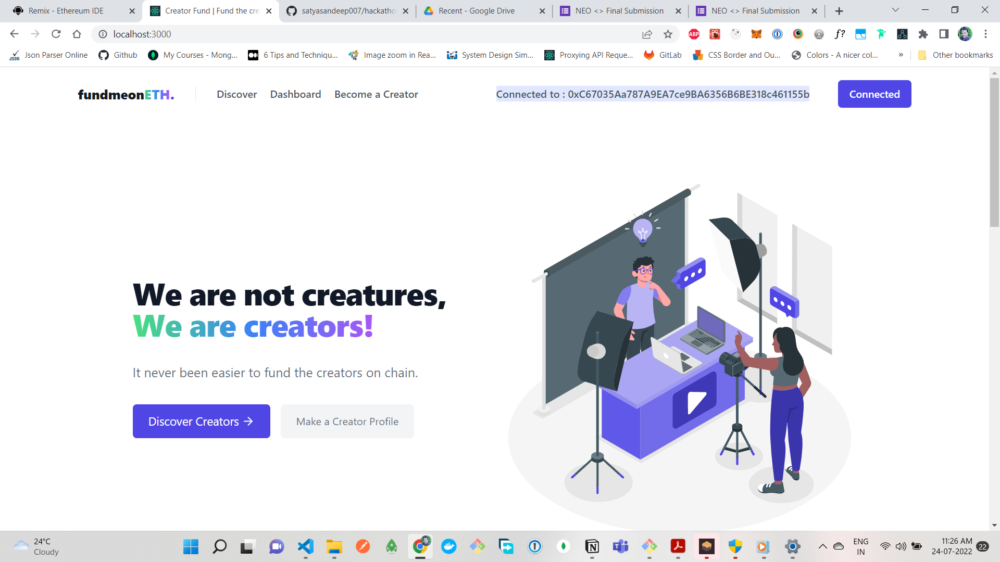

# FundmeonETH





## 🧐 Abstract

There are many underrated and unrecognized content creators who work hard every single day without much recognition. With the existing social media platforms, these creators do not get enough for the work they put in. What if we can help them by creating a platform to fund their content with new-age tech?


## 🙌🏻 Our Solution 
A decentralized platform for content creators to fund their content with new-age tech.
The creators can create a profile and upload their content. and can ge the the funds they need to fund their content. User can fund the creators.

## Video link :

[demo video](https://drive.google.com/file/d/1PETFqAv_XkdnjsLZVuveH4GtvgKWENn8/view?usp=sharing)

### LinkedIn Post

[linked post](https://www.linkedin.com/posts/shivakumarmangina_blockchain-crypto-activity-6956852650256601088-f7H4?utm_source=linkedin_share&utm_medium=member_desktop_web)

### Hackathon Video

[youtube](https://m.youtube.com/watch?t=2220&v=JQu8kOVN_Xw&feature=youtu.be)


## Tech Stack:

- React
- Tailwind CSS
- Hard Hat
- Solidity
- Ganache
- Remix
- Ethereum
- Metamask


## To Run the Project

1. Metamask : Install wallet extension on your browser.
2. Ganache:  Install ganache in your system and create basic setup and import some accounts in your metamask wallet

```
// Solidity
$ cd solidity
$ npm install
$ npx hardhat clean
$ npx hardhat compile
$ npx hardhat run .\scripts\deploy.js --network local 
$ npx hardhat --network local verify {YOUR_CONTRACT_ADDRESS}

// React
$ npm install
$ npm run start
```
## ✨ Future Scope
 - Unique NFT Collections per video.
 - Recommendation of NFT Value based on number of likes and views.
 - Video highlights based on most replayed parts of the video.

## 👫 Contributors 
* [Shiva Kumar Mangina](https://github.com/shivamangina)
* [Sandeep Kumar](https://github.com/satyasandeep007)